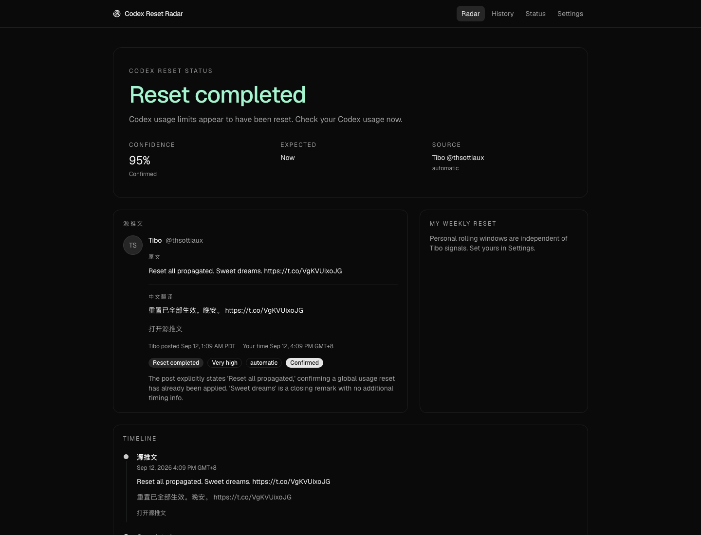

# Codex Reset Radar

A source-first dashboard that answers one question:

> Is OpenAI likely to reset Codex usage limits soon, has a reset been announced, or has one already happened?

It monitors public posts from Codex lead Tibo Sottiaux (`@thsottiaux`), classifies reset signals with MiniMax, extracts timing, translates the source tweet, and can alert Telegram.

This is not an OpenAI product. It never spends a banked reset, never stores ChatGPT passwords, and never scrapes private ChatGPT pages.

Live: [https://tibo.wu2chen.com](https://tibo.wu2chen.com)



## Architecture

```
User → Next.js dashboard (Vercel)
         ↑
      Supabase Postgres
         ↑
cron-job.org  (primary, every 5 minutes)
GitHub Actions (backup)
  GET /api/cron/check-tibo
    XSource → dedupe → MiniMax analyzer → ResetEngine → Telegram / browser → dashboard
```

Details: [docs/architecture.md](docs/architecture.md)

## Data flow

1. Cron authenticates with `Authorization: Bearer CRON_SECRET`.
2. `XSource` fetches Tibo’s latest public posts.
3. Posts are stored once (`platform + external_id`).
4. New posts are classified by MiniMax (`MiniMax-M3`) and translated to Simplified Chinese.
5. Related posts within 72 hours merge into one reset event.
6. The dashboard shows no-reset / possible / incoming / live / banked / completed, plus original tweet and translation.

## Tech stack

- Next.js App Router, TypeScript, Tailwind CSS, shadcn/ui
- Vercel Hobby + serverless functions
- Supabase PostgreSQL
- MiniMax Token Plan for analysis
- cron-job.org for scheduling
- Zod, Luxon, Vitest, pnpm

## Local development

```bash
pnpm install
cp .env.example .env.local
pnpm dev
```

Open [http://localhost:3000](http://localhost:3000).

```bash
pnpm lint
pnpm typecheck
pnpm test
pnpm build
```

## Environment variables

See `.env.example`. Never commit `.env.local`.

| Variable | Where | Purpose |
| --- | --- | --- |
| `NEXT_PUBLIC_APP_URL` | Public | Canonical site URL |
| `NEXT_PUBLIC_SUPABASE_URL` | Public | Supabase API URL |
| `NEXT_PUBLIC_SUPABASE_ANON_KEY` | Public | Read-only key |
| `SUPABASE_SERVICE_ROLE_KEY` | Server | Cron writes |
| `X_BEARER_TOKEN` | Server | Official X API |
| `AI_PROVIDER` | Server | `minimax` (this deploy), `xai`, or `openai` |
| `AI_API_KEY` | Server | MiniMax Token Plan key (`sk-cp-...`) |
| `AI_MODEL` | Server | `MiniMax-M3` |
| `AI_BASE_URL` | Server | China: `https://api.minimaxi.com/v1` |
| `CRON_SECRET` | Server | Protects `/api/cron/check-tibo` |
| `TELEGRAM_BOT_TOKEN` | Server | Optional Telegram alerts |
| `TELEGRAM_CHAT_ID` | Server | Telegram chat id |
| `ALLOW_MANUAL_INGEST` | Server | Production must be `false` |
| `DEFAULT_TIMEZONE` | Server | `Asia/Shanghai` |

## Cron (cron-job.org)

Vercel Hobby cannot run a 5-minute native cron. Use [cron-job.org](https://cron-job.org) (free):

| Field | Value |
| --- | --- |
| URL | `https://tibo.wu2chen.com/api/cron/check-tibo` |
| Method | `GET` |
| Header | `Authorization: Bearer <CRON_SECRET>` |
| Schedule | every 5 minutes (`*/5 * * * *`) |
| HTTP authentication | off |

Do not use a Vercel URL that has Deployment Protection (SSO). Use the custom domain or an unprotected `*.vercel.app` alias.

Test run should return HTTP 200:

```json
{"success":true,"postsFetched":9,"newPosts":0}
```

GitHub Actions workflow `.github/workflows/check-tibo.yml` is an optional backup. The monitor is idempotent.

## Telegram

1. Create a bot with [@BotFather](https://t.me/BotFather).
2. Start a chat with the bot, then read `chat.id` from `getUpdates`.
3. Set `TELEGRAM_BOT_TOKEN` and `TELEGRAM_CHAT_ID` on Vercel and redeploy.

Alerts fire for global / banked / upcoming / completed resets. High-confidence teasers only. Unrelated posts never notify. Each event status is sent once per provider.

## X API

Pay-per-use. A Bearer Token is required. Duplicate post/user reads in a 24-hour UTC window are typically not billed twice. If credits hit zero, history is kept and `/status` records the error.

## Vercel

1. Import this GitHub repository.
2. Add environment variables in the dashboard (do not upload `.env.local` to git).
3. Run `supabase/migrations/*.sql`.
4. Deploy.
5. Attach a custom domain; keep DNS at the registrar.
6. Point cron-job.org at `/api/cron/check-tibo`.
7. Confirm `/status` shows database connected, AI online, and a fresh last check.

## Testing

```bash
pnpm test
```

Manual ingest is `/dev/ingest` when `ALLOW_MANUAL_INGEST=true` or `NODE_ENV !== production`.

## Security

- Cron returns 401 without `Authorization: Bearer CRON_SECRET`.
- Service role, X, AI, cron, and Telegram secrets are server-only.
- LLM JSON is Zod-validated before insert.
- Post text is rendered as text, not HTML.
- RLS: `anon` / `authenticated` can `SELECT` only.

## Troubleshooting

| Symptom | Check |
| --- | --- |
| Dashboard empty | Supabase URL/keys and migrations |
| `/status` AI waiting | `AI_API_KEY` + `AI_PROVIDER=minimax` |
| Cron 401 | `Authorization: Bearer CRON_SECRET` header, not HTTP basic auth |
| Cron 401 on `*-wu2-chen.vercel.app` | Deployment Protection; use `tibo.wu2chen.com` |
| Last check stale | cron-job.org enabled and Test Run 200 |
| Stale errors on `/status` | Only failures after the latest success are shown |
| Telegram silent | Bot started, chat id set, then redeploy |

## Project structure

```
app/            routes and API handlers
components/     dashboard, history, settings, ui
lib/            env, time, validation, queries
services/       social, ai, reset, notifications, monitor
supabase/       SQL migrations and RLS
scripts/        historical import
tests/          Vitest suites
docs/           architecture and source rules
```
